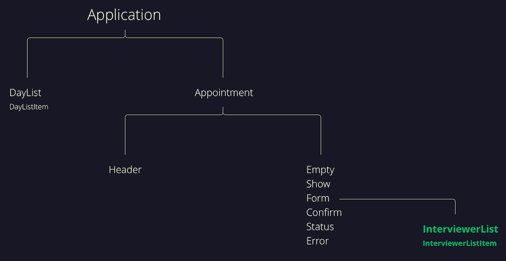

# Interview Scheduler
* Scheduler is one of Lighthouse Labs projects that teaches us on using React JS.
* A single page web app that allows students to book time with interviewers between 12pm to 5pm from Monday to Friday.
* Students can chose a day and hour and select the available interviewers.
* The feature also allows you to delete and edit your appointment.


<br>
<br>

# Stack: 
## Front End:
* [React](http://reactjs.org)
* [Axios](https://github.com/axios/axios)
* [SASS](https://sass-lang.com/)

## Back End:
* [Node.js](https://nodejs.org/)
* [Express JS](https://expressjs.com/)

## Database:
* [PostgreSQL](https://www.postgresql.org/)

## Test Environment:
* [Jest](https://jestjs.io/)

## Component Design
* [Storybook](https://storybook.js.org/)

# Scheduler Main Window:


## Scheduler Components and Flow Chart:
# 
### Component Layout:


### Component Flow Map:


# 
## Edge case
* An error prompt will initialize if student name is left blank 

* An error prompt will initialize if an interviewer is not selected

#
## Error Handling:
### For errors on saving and deleting, an error prompt will initialize:


## Setup

Install dependencies with `npm install`.

## Running Webpack Development Server

```sh
npm start
```

## Running Jest Test Framework

```sh
npm test
```

## Running Storybook Visual Testbed

```sh
npm run storybook
```
